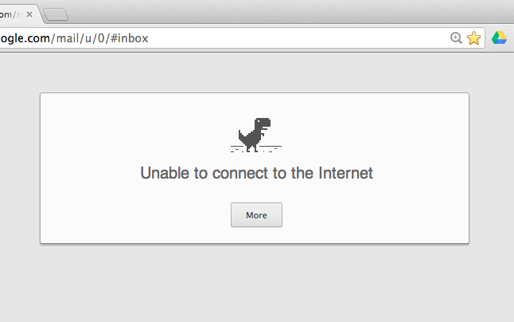
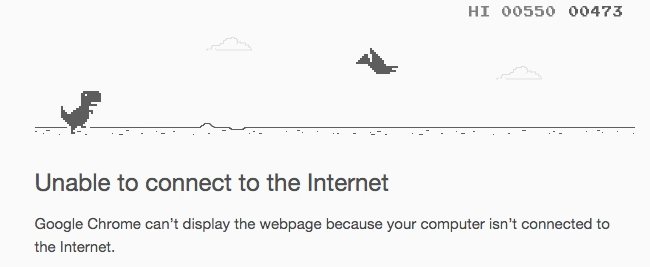
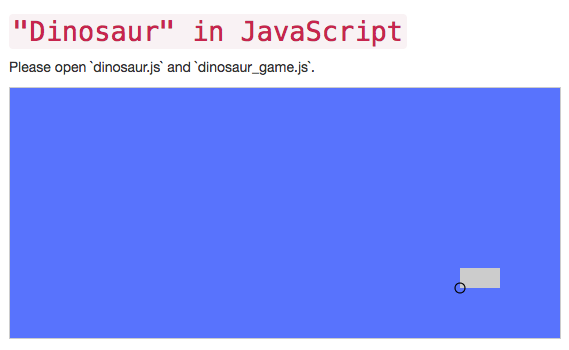

# Dinosaur Game

## Introduction

When Google Chrome is unable to connect to the internet it
displays this screen.



If you hit the <kbd>Space</kbd> it turns into a game.



For this exercise, we're re-make this game.
[Go ahead and try it!](http://apps.thecodepost.org/trex/trex.html)

## A note about coordinates

We will be building our game in a box 550 pixels wide and 250 pixels high.
This box is backed by a browser element called `canvas`. The coordinate
system for canvases is slightly different than what you may have seen
before. Positive X's are right and negative X's are left, just like usual,
but positive Y's are down, rather than up. This picture might describe it
best for you:


So the bigger your Y value, the farther down you'll be!

---

## Your tasks

### Part 0: Getting started

1. Open `dinosaur.js` in your text editor, your code will go here.
1. Open `dinosaur_game.js` in your text editor, these are the functions you
   will use to build the game. See *All in the `game`* below for full
   documentation.
1. Open `dinosaur.html` in your browser.

When you're done you should see this:



### Part 1: Moving obstacle

#### You will need

- [setInterval()](http://www.w3schools.com/jsref/met_win_setinterval.asp)
- `game.clear()`
- `game.drawObstacle()`
- `game.width`

#### Steps

1. Write a function called `eventLoop()` that clears the screen with
  `game.clear()` and draws the obstacle 10 pixels to the left of where it used
  to be. You'll need to remember use a variable outside the function to remember
  the location of the obstacle so you can recalculate its new location.

    ```javascript
    game.onReady(function() {
      var obstacleX = 450;
      function eventLoop() {
        obstacleX = obstacleX - 10; // move obstacle 10 pixels leftmost
        // clear screen
        // draw obstacle again
      }
    });
    ```

1. Use`setInterval()` to run this loop run every 100ms (i.e. 10 times/second).

    ```javascript
    setInterval(eventLoop, 100);
    ```
1. Inside `eventLoop()`, when the obstacle reaches the leftmost side of the screen
  (x coordinate of `0`), move it to the rightmost side of the screen (x
  coordinate of `game.width`).

#### Your game should look like


### Part 3: Jumping dinosaur

#### You will need

- `game.drawDinosaur()`
- `game.onUpArrow()`

#### Steps

1. Create a variable outside `eventLoop()` called `dinosaurY` and set it to 200.
  Use this variable to draw the Dinosaur inside `eventLoop` with
  `game.drawDinosaur(100, dinosaurY)`
1. Create a variable outside `eventLoop()` called `dinosaurVelocity` and set
  it to 0. Inside `eventLoop()` subtract the value of `dinosaurVelocity` from
  `dinosaurY`. (Y coordinates grow as you go further down the page.)

    ```javascript
    dinosaurY = dinosaurY - dinosaurVelocity;
    ```

1. When the user presses the up arrow, set `dinosaurVelocity` to `10`. Watch
  your dinosaur fly.

    ```javascript
    game.onUpArrow(function() {
      dinosaurVelocity = 10;
    });
    ```

1. Now bring your dinosaur back to earth. Inside `eventLoop()`, if
  `dinosaurY` is less than `100`, set `dinosaurVelocity` to `-10`.
1. Now prevent your dinosaur from going underground. Inside `eventLoop`,
  if `dinosaurY` is greater than `200`, set `dinosaurVelocity` to `0` and
  `dinosaurY` to `200`;

#### Your game should look like


### Part 3: Dinosaur collision

#### You will need

- [clearInterval()](http://www.w3schools.com/jsref/met_win_clearinterval.asp)
- `game.drawMessage()`

#### Steps

1. Create a variable and save the return value of the `setInterval()` call
  you made earlier.

    ```javascript
    var interval = setInterval(eventLoop, 100);
    ```

1. Inside `eventLoop()`, if the x, y coordinates of the dinosaur and
  the obstacle are the same, then display a message telling the user
  they have lost with `game.drawMessage('You lose :(')` and stop the game
  with `clearInterval(interval)`.

#### Your game should look like


### Part 4: Keeping score

#### You will need

- `game.drawScore()`

#### Steps

1. Create a variable outside `eventLoop()` called `score` and initialize it to
  `0`.
1. Each time `eventLoop()` is called increase `score` by 1 and display it
  using `game.drawScore()`.

#### Your game should look like


### Part 5: Restarting games

If the user presses up when the game is over (i.e. after dinosaur and
obstacle have collided), restart the game by resetting the score, the
coordinates of the dinosaur and the obstacle and then running `setInterval()`
again.

#### Your game should look like


### Part 6: High score

#### You will need

- `game.drawHighScore()`
- `game.getHighScore()`
- `game.saveHighScore()`

#### Steps

1. Outside `eventLoop()`, look up the last high score with `game.getHighScore()`
  and save it in a variable `highScore`.
1. Inside `eventLoop()` if `score` is greater than `highScore` update `highScore`
  and save it with `game.saveHighScore()`.
1. Inside `eventLoop()` display the high score with `drawHighScore()`.

#### Your game should look like


### (Bonus) Part 6: Better collisions

Right now we only detect collisions if the lower-left corner of the dinosaur
and the obstacle are in exact the same spot. We should detect if dinosaur and
obstacle are colliding by checking if their rectangles overlap at all.
Use the
[Axis Aligned Bounding Box algorithm](https://developer.mozilla.org/en-US/docs/Games/Techniques/2D_collision_detection)
to do this.

#### Your game should look like


### (Bonus) Part 5: Basic physics

Make the dinosaur decelerate smoothly when it's in the air. You can achieve
this effect by checking if `dinosaurY` is less than `200` and reducing
`dinosaurVelocity` at each step.

Experiment with gravity by changing the initial speed and the acceleration factor.

#### Your game could look like


### (Bonus) Part 7: Smoother animations

Use the browser built-in `requestAnimationFrame()` function to make the
animations more smooth.
[This link](http://creativejs.com/resources/requestanimationframe/) explains
how!

[Live demo](https://codepen.io/moose-horizons/full/pNKjRP)

### Super bonus zone

For additional fun try implementing these improvements in your dinosaur
game:

- Increase obstacle speed as the score goes higher, so the game becomes more
  difficult as it progresses.
- Implement "double-jump," allow the user to jump one more time when the
  dinosaur is in the air.
- Display 2 obstacles on the screen at a time.
- Permit the dinosaur to land on top of obstacle like in Mario. In this case
  the dinosaur only dies if it hits the leading edge of the obstacle.

---

### All in the `game`

To make the game, we're providing you with functions to make interacting with
the browser easier. These functions are available under the global object
`game`. They are found in the file `dinosaur_game.js`.

##### `game.height`

This number represents the height of the game board in pixels.

##### `game.width`

This number represents the width of the game board in pixels.

##### `game.dinosaurHeight`

This number represents the height of a dinosaur in pixels.

##### `game.dinosaurWidth`

This number represents the width of a dinosaur in pixels.

##### `game.obstacleHeight`

This number represents the height of an obstacle in pixels.

##### `game.obstacleWidth`

This number represents the width of an obstacle in pixels.

##### `game.clear()`

This function clear the canvas. The Canvas Element works like a real canvas -
once you've painted something, it will stay there. That feature is annoying if
you're building a game and want to move things around - the old image will stay
where you drew it last, and so you see a 'lagging' sort of effect.

Kind of like this:


So, when you want to move objects, you have to clear the canvas before you do, otherwise it's Windows 95 all over again.

##### `game.drawDinosaur(x<Number>, y<Number>)`

This function draws the `Dinosaur` object to the screen. Really, it's just an
orange-redish (coral?) rectangle, but it's the thought that counts. It will
draw a rectangle at point (x, y), with the given arguments being the bottom
left corner of the `Dinosaur` rectangle.

##### `game.drawObstacle(x<Number>, y<Number>)`

This function draws an `Obstacle` object to the screen, much like `.drawDinosaur`.

##### `game.drawMessage(text<String>)`

This function draws a large message in the middle of the board for the user to
see.

##### `game.onUpArrow(fun<Function>)`

This function takes a function 'fun' and starts listening for the 'UP' key. It
will execute 'fun' whenever the <kbd>Up</kbd> is pressed on the keyboard.

##### `game.saveHighScore(score<Number>)`

This function saves the given high score in the browser.  You can read this
value back with `game.getHighScore()` even if the browser window is closed or
refreshed.

##### `game.getHighScore()`

This function returns the last saved high score or `0` if there are no saved high scores.

##### `game.clearHighScore()`

This function resets the saved high score, so the next time you call `game.getHighScore()`
it will return 0.
